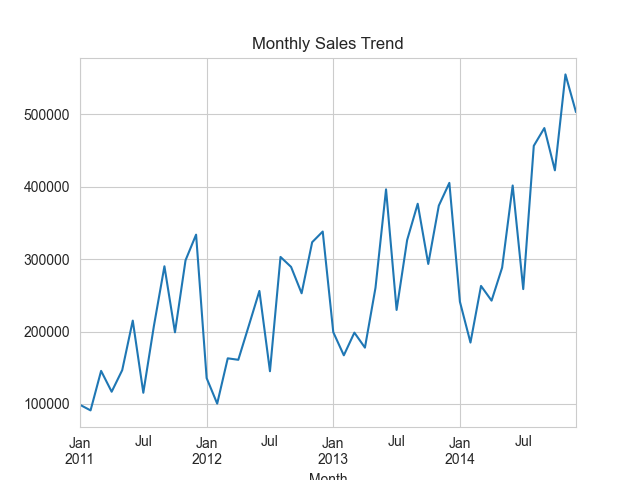
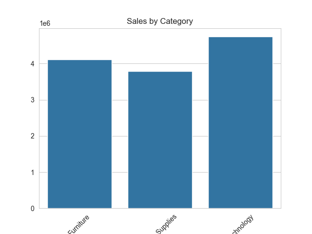
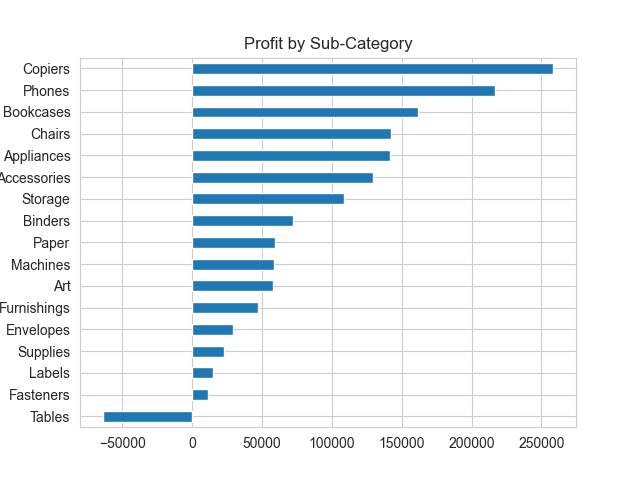
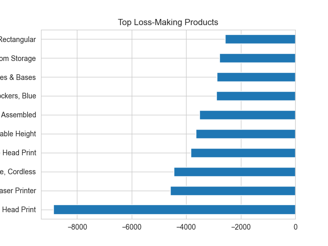
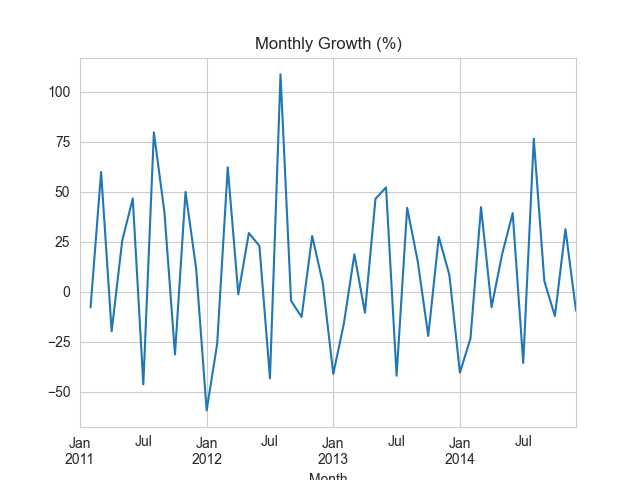
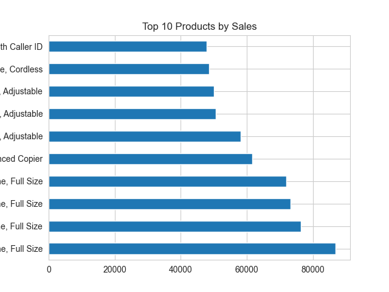
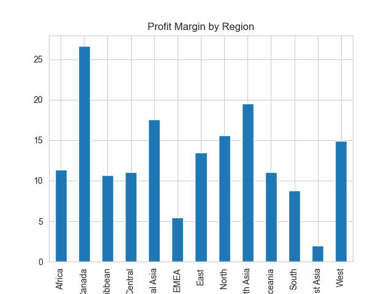
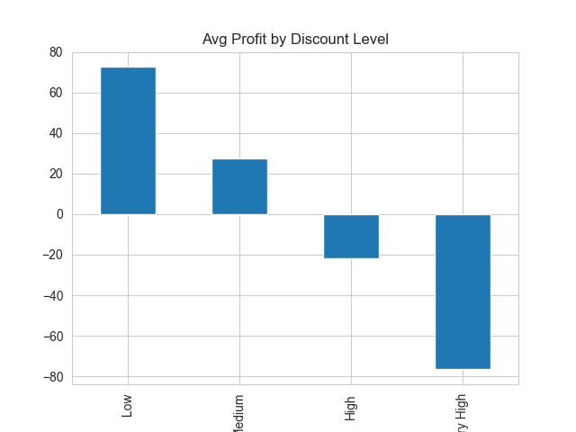
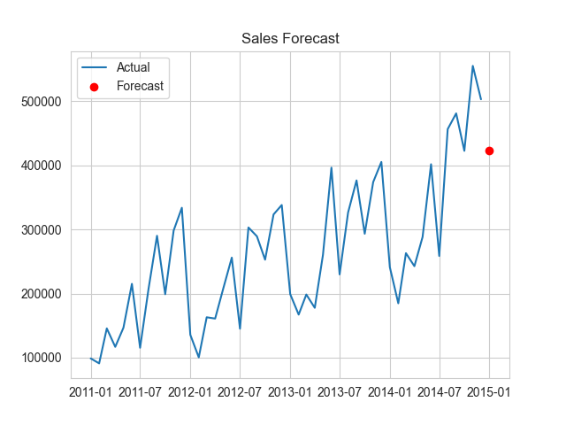

# 📊 Retail Sales Analysis & Forecasting System

## 🚀 Project Overview

This project is an end-to-end **Retail Sales Analytics and Forecasting system** built using Python. It transforms raw transactional data into **actionable business insights** and predicts future sales using machine learning.

The system helps businesses:

* Understand sales performance
* Identify profit drivers and losses
* Segment customers
* Optimize pricing and discounts
* Forecast future revenue

---

## 📸 Dashboard Preview



---

## 🎯 Business Problem

Retail businesses often struggle to:

* Identify high-performing vs loss-making products
* Understand the impact of discounts on profitability
* Recognize valuable customers
* Predict future sales demand

This project provides a **data-driven decision-making framework** to solve these challenges.

---

## 🧠 Solution Approach

### 1. Data Processing

* Cleaned and transformed ~50K transaction records
* Handled missing values and inconsistent formats
* Converted date and numeric fields

---

### 2. Exploratory Data Analysis (EDA)

* Category-wise and product-wise sales
* Monthly trends and growth rate
* Regional performance

---

### 3. 👥 Customer Segmentation (RFM)

Customers segmented into:

* Champions
* Loyal Customers
* At-Risk Customers

👉 Helps target marketing and retention strategies

---

### 4. 💰 Profitability & Discount Analysis

* Identified loss-making products
* Analyzed discount vs profit relationship
* Evaluated regional profit margins

---

### 5. 🔮 Sales Forecasting (Basic Machine Learning)

Built a forecasting model using:

* Lag features (past sales)
* Rolling averages
* Trend and seasonality

📊 Model:

* Linear Regression with feature engineering

📏 Evaluation:

* Mean Absolute Error (MAE)

👉 Predicts **next month sales** for planning and decision-making

---

## 📊 Results & Visualizations

### 📈 Sales by Category



### 📉 Profit by Sub-Category



### ⚠️ Loss-Making Products



### 📅 Monthly Sales Trend


### 📊 Monthly Growth Rate



### 🏆 Top Products



### 🌍 Profit Margin by Region



### 🎯 Discount Impact on Profit



### 🔮 Sales Forecast



---

## 📄 Generated Insights & Recommendations

### 🧠 Key Insights

Detailed insights available at:
👉 `outputs/insights.txt`

Examples:

* Top customers contribute a significant portion of revenue
* High discounts negatively impact profitability
* Some products consistently generate losses
* Sales show seasonal trends

---

### 🎯 Business Recommendations

Detailed recommendations available at:
👉 `outputs/recommendations.txt`

Examples:

* Reduce excessive discounting
* Re-evaluate pricing for loss-making products
* Focus on high-performing products
* Improve operations in low-profit regions

---

### 📊 Forecast Output

Next month sales prediction stored in:
👉 `outputs/sales_forecast.csv`

---

## 🛠️ Tech Stack

* Python
* Pandas
* Matplotlib & Seaborn
* Scikit-learn
* Streamlit

---

## 📂 Project Structure

```
retail-sales-analysis/
│
├── data/                  # Dataset
├── outputs/               # Generated insights & results
├── screenshots/           # Charts & visualizations
│
├── src/
│   ├── data_loader.py
│   ├── cleaning.py
│   ├── analysis.py
│   ├── forecasting.py
│   ├── visualization.py
│   ├── insights.py
│
├── app.py                 # Streamlit dashboard
├── main.py                # Pipeline entry point
├── requirements.txt
└── README.md
```

---

## ▶️ How to Run

```bash
# Clone repository
git clone <your-repo-link>

# Navigate to project
cd retail-sales-analysis

# Install dependencies
pip install -r requirements.txt

# Run analysis pipeline
python main.py

# Run dashboard
streamlit run app.py
```

---

## 💼 Resume Value

This project demonstrates:

* End-to-end data analytics pipeline
* Business-driven insights generation
* Customer segmentation (RFM)
* Time-series forecasting with feature engineering
* Data visualization and dashboarding

---

## 🔮 Future Enhancements

* Advanced forecasting (ARIMA / Prophet)
* Model comparison (Random Forest, XGBoost)
* Cloud deployment (Streamlit Cloud)
* Real-time analytics

---

## 👨‍💻 Author

**Sanjay Kumawat**

---

## ⭐ Support

If you found this project useful, consider giving it a ⭐ on GitHub!
